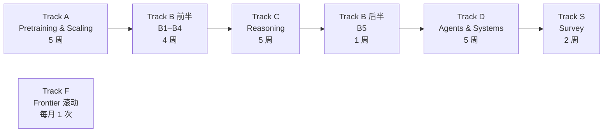

# OpenAI Innovation Algorithms Curriculum

Last verified: 2026-09-13
Time budget: 每周 3～4 小时（1 次主 session 约 2 小时 + 1～1.5 小时实验或复习）
Total: 22 个核心 session + 每月 1 次前沿滚动 session ≈ 6 个月

---

## 设计原则

1. **按四条因果主线组织，不按产品发布顺序。** 每条线内部按时间推进，每一节必须写清"承接的瓶颈"。
2. **深度分级。** 四条主线目标 mastery 3；Survey 线目标 mastery 1～2；Frontier 线只做证据分类，不要求 mastery。
3. **实验是完成标准，不是独立阶段。** 五个核心实验嵌在各节里，且前后复用同一套代码与模型。
4. **图例优先，分工明确。** 每个核心机制至少一张图，教学用图由教练画。用户只负责每条主线结束时的"主线因果图"，默认用因果表（上一代 / 下一代 / 瓶颈）由教练转成图；复测用填空骨架。评分看内容不看语法。
5. **前沿不写死。** Track F 的内容来自 `sources/source-status.md`，每月刷新，新内容先进 candidates。

---

## 学习顺序

Track B 拆成两半，因为 Deliberative Alignment、CoT Monitoring 和 GPT-Red 都建立在 reasoning model 之上，必须先学 Track C。

---

# Track 0：前置知识（不占周数，在 A1 内完成诊断）

只包含真正的前置项，其余内容由各 Track 教：

- Transformer decoder 结构（attention、MLP、residual、layernorm）
- Autoregressive language modeling 与 cross entropy
- 梯度下降与 fine-tuning 的基本概念
- Python / PyTorch 能写训练循环

诊断用统一的 8 项清单，见 `AGENTS.md` Initialization。

---

# Track A：Pretraining & Scaling（5 周）

主线问题：**如何在没有标注的情况下，用越来越大的模型学到可迁移的通用能力？**

## A1 Transformer decoder 与 next-token objective

- 承接瓶颈：RNN 难以并行、长程依赖弱；任务专用模型无法共享表征
- 核心：decoder-only、causal mask、teacher forcing
- 图：一张 decoder block 数据流图（tensor shape 标注）
- 实验 E1 启动：写一个 tiny GPT（字符级或 BPE 小词表）
- 非 OpenAI 依赖：Attention Is All You Need（2017）

## A2 Sentiment Neuron → GPT-1

- 承接瓶颈：无监督表征是否包含语义？（2017 sentiment neuron 给出正向证据）
- 核心：generative pretraining + task-aware input transformation + supervised fine-tuning
- 图：pretrain → fine-tune 的两阶段流程图，标出哪些参数共享
- 实验 E1 完成：同一 tiny GPT 先预训练再 SFT，对比从零训练

## A3 GPT-2：zero-shot 与 prompt 即任务说明

- 承接瓶颈：每个任务还要 fine-tune 一次
- 核心：扩大无监督 LM，任务由文本条件隐式指定；staged release 的公开原因
- 图：fine-tune 路径 vs prompt 路径对比图
- 公开边界：GPT-2 完整权重与论文公开

## A4 Scaling Laws 与其修正

- 承接瓶颈：怎样决定下一次训练该多大？
- 核心：loss 对 N、D、C 的幂律；compute-efficient frontier
- 对照（非 OpenAI）：Chinchilla（2022）修正 N 与 D 的最优分配比例
- 延续：GPT-4 报告中的 predictable scaling（用小模型预测大模型 loss）
- 图：loss–compute 双对数图 + Kaplan vs Chinchilla 分配示意
- 实验 E2：用 E1 的代码训 3～4 个尺寸，拟合幂律

## A5 GPT-3 与 In-context Learning

- 承接瓶颈：zero-shot 不稳定，few-shot 需要梯度更新
- 核心：任务示例放进上下文、无梯度更新；zero/one/few-shot 的差异；能力与局限
- 图：ICL 与 fine-tune 在"参数是否变化"和"信息进入路径"上的对比
- 实验 E3：用 E1 的模型或 GPT-2 small 做 zero/few-shot 探针

**Track A 完成标准**

- 用因果表写出 A1～A5 的链条，每一步说明解决了上一步的什么瓶颈；教练转成图写入 MOC
- E1、E2、E3 完成，且 E2 的拟合结果能解释 Chinchilla 为何修正 Kaplan
- 能说清 GPT-3 论文公开了什么、没公开什么

---

# Track B：Alignment（4 周 + 1 周）

主线问题：**一个只会续写的模型，如何变成按人的意图行事的模型？**

## B1 PPO 与 Learning from Human Preferences（2017）

- 承接瓶颈：许多任务没有可编程的 reward
- 核心：从成对比较学 reward model（Bradley–Terry）；PPO 的 clipped objective
- 图：preference → RM → policy 的闭环图；PPO clip 的示意图
- 注意：这两篇都是 OpenAI 2017 年论文，是整条线的起点，不是 2020

## B2 Learning to Summarize（2020）

- 承接瓶颈：把 RLHF 用在语言模型上会不会 reward hacking？
- 核心：RM + PPO + KL penalty；RM 过优化现象
- 图：带 KL 项的 RLHF 训练循环
- 实验 E4 启动：toy reward model（用小型 pretrained LM）

## B3 InstructGPT 与 ChatGPT

- 承接瓶颈：GPT-3 不听指令，输出有害或不实
- 核心：SFT → RM → PPO 三阶段；alignment tax；对未见指令的泛化
- ChatGPT：对话数据 + 迭代部署，算法上是 InstructGPT 的延续
- 对照（非 OpenAI）：DPO 用闭式解跳过显式 RM，理解它有助于分清"偏好优化"与"PPO"
- 图：InstructGPT 三阶段图，标注每阶段的数据来源和参数更新对象
- 实验 E4 完成：RM + 一轮简化策略优化，观察 KL 与 reward 的权衡

## B4 Scalable Oversight

- 承接瓶颈：模型能力超过标注者时，人怎么继续监督？
- 核心：CriticGPT（用模型找错）、Prover–Verifier Games（可验证性训练）、Weak-to-strong generalization
- 图：oversight 三种方案的对比图
- 公开边界：这些是研究论文，未说明在生产模型中的具体使用方式

## B5 Reasoning 时代的对齐（在 Track C 之后学）

- 承接瓶颈：有了 chain-of-thought 后，安全训练能否利用推理？隐藏推理能否被监控？
- 核心：Deliberative Alignment（把 spec 当训练材料）、Model Spec、Instruction Hierarchy、CoT Monitoring、GPT-Red（自博弈红队）
- 图：spec → reasoning → behavior 的映射图；attacker/defender 自博弈循环图
- 公开边界：GPT-Red 有论文；其在生产训练中的精确接入方式为 Public system behavior
- 可选实验 E8：只在无害文本分类环境中做 attacker/defender toy 自博弈

**Track B 完成标准**

- 用因果表写出 2017 → 2020 → 2022 → 2024 的 alignment 链条；教练转成图写入 MOC
- E4 完成，能解释 KL penalty 在做什么
- 能区分 RLHF、DPO、deliberative alignment 三者改变的是训练流程的哪一环

---

# Track C：Reasoning（5 周）

主线问题：**如何让模型在推理时花更多计算换更高正确率，并把这种行为训练出来？**

## C1 Outcome vs Process Supervision

- 承接瓶颈：只奖励最终答案会奖励错误过程
- 核心：step-level reward、PRM vs ORM；PRM800K 数据集公开
- 图：ORM 与 PRM 的 reward 信号落点对比图
- 实验 E5 启动：在 GSM8K 子集上比较 ORM 与 PRM 的重排效果

## C2 o1：RL on Chain-of-Thought

- 承接瓶颈：prompt 出来的 CoT 不稳定，且不随训练变强
- 核心：大规模 RL 训练推理链；train-time RL compute 与 test-time compute 两条 scaling 曲线；隐藏 CoT 的官方理由
- 图：两条 scaling 曲线图；o1 与 InstructGPT 训练流程的差异图
- 公开边界：o1 的训练数据、RL 算法细节、reward 设计均未公开，只公开曲线与行为

## C3 Test-time Compute 的公开机制

- 承接瓶颈：怎样把"多想一会儿"变成可控参数？
- 核心：pass@k、majority vote、verifier reranking；API 的 reasoning effort 参数（none → max）是 Public system behavior；GPT-5.6 system card 的 effort–performance 曲线
- 图：budget → accuracy 曲线，标注不同采样策略
- 实验 E5 完成：同一题集上跑 pass@k 与 verifier 重排，画出 budget 曲线

## C4 o3 / o4-mini：Tool-integrated Reasoning

- 承接瓶颈：纯文本推理无法执行、无法查证
- 核心：在推理链中调用 Python、搜索、图像操作；视觉推理进入 CoT
- 图：带 tool call 的推理链时序图
- 公开边界：工具调用在推理中的训练方式未公开

## C5 GPT-5 Unified System 与 effort 控制

- 承接瓶颈：用户不该自己选模型
- 核心：fast model + reasoning model + real-time router；minimal reasoning；parallel test-time compute；safe-completions
- 延续：GPT-5.6 的 max effort、Sol/Terra/Luna 分层
- 图：ChatGPT router 系统图，区分 ChatGPT 系统路由与 API 直接访问
- 可选实验 E7：写一个 fast/reasoning router 并测量成本与正确率权衡

**Track C 完成标准**

- 用因果表写出 process supervision → o1 → o3 → GPT-5 的链条；教练转成图写入 MOC
- E5 完成，能解释为什么 PRM 在 budget 增大时优势更明显（或不明显）
- 能分清 pretraining compute、RL compute、test-time compute 三者

---

# Track D：Agents & Systems（5 周）

主线问题：**模型如何在环境里多步行动，系统如何让这种行动可靠？**

## D1 Codex（2021）与 WebGPT

- 承接瓶颈：语言模型不会执行动作，也不会引用证据
- 核心：Codex 2021 论文（代码 fine-tune + pass@k 评估）；WebGPT 的浏览器动作空间与引用 RLHF
- 注意：Codex 2021（模型）与 Codex 2025（agent 产品）同名不同物
- 图：WebGPT 的 observation → action → reward 循环图

## D2 Function Calling、Responses API 与 Deep Research

- 承接瓶颈：工具调用需要结构化接口，长任务需要多步合成
- 核心：function calling / structured outputs 作为 Public system behavior；Deep Research 的搜索–阅读–合成流程
- 图：单次 tool call 的消息格式序列图
- 公开边界：Deep Research 的训练方式只有概述

## D3 Codex（2025）Agent Loop、Compaction 与 Harness

- 承接瓶颈：长任务会撑爆上下文，且动作有副作用
- 核心：Unrolling the Codex agent loop；sandbox；context compaction；App Server 与 harness engineering
- 图：agent loop 状态机图；compaction 前后上下文结构图
- 实验 E6：最小 agent loop + compaction，测量长任务下的 token 与成功率

## D4 gpt-oss：唯一可深读的开放架构

- 承接瓶颈：其他 OpenAI 模型架构不公开，需要一个可审计的锚点
- 核心：MoE、total vs active 参数、交替 dense/banded sparse attention、GQA、SFT + high-compute RL
- 图：gpt-oss 一层的结构图，标注 expert routing
- 可选实验 E9：加载 gpt-oss-20b 权重做架构分析（需 ≥16 GB 内存，可只读 config 不推理）

## D5 Multi-agent 与 Orchestration

- 承接瓶颈：单 agent 串行，且难以人工审查
- 核心：subagents、Symphony（issue tracker 作为控制平面）、GPT-5.6 ultra 的并行 workstream；协调开销与合并验证
- 图：单 agent vs 并行 subagents 的时序对比图
- 可选实验 E7 扩展：单 agent 与 2～3 个 subagent 在可拆分任务上的质量/成本/时延比较

**Track D 完成标准**

- 用因果表写出 Codex 2021 → WebGPT → Codex 2025 → multi-agent 的链条；教练转成图写入 MOC
- E6 完成，能说清 compaction 丢了什么、保留了什么
- 能分析 gpt-oss 公开架构，并说明它不能推断闭源模型架构

---

# Track S：Survey（2 周，目标 mastery 1～2）

只要求能识别时间、术语和范式差异，不做实验。

## S1 Multimodal

- CLIP（对比学习、自然语言监督、zero-shot 分类）
- DALL·E 系列（文本条件生成；自回归 → 扩散）
- Whisper（大规模弱监督语音）
- GPT-4 / GPT-4o（多模态 frontier model；omni 实时交互）
- Sora（space-time patches；world simulator 假说）
- 图：contrastive / generative / omni 三种范式的一张对比图

## S2 Voice 与 Full-duplex

- GPT-Live：cascaded → turn-based end-to-end → full-duplex 三代架构
- 边听边说、委托 frontier model、打断与调度
- 图：三代 voice 架构图

---

# Track F：Frontier 滚动（每月 1 次 session）

流程固定，内容从 `sources/source-status.md` 读取：

1. 只搜 OpenAI 官方域名，找上月之后的新模型、system card、研究文章
2. 对每条新内容做四分类：Public algorithm / Public system behavior / Inference / Unknown
3. 写入 `knowledge/F-frontier/`（`status: candidate`）
4. 判断是否影响四条主线的因果链；影响则提议修改课程，不直接改
5. 更新 `sources/source-status.md` 与 `timeline.md`

当前待处理：GPT-6 Astra（2026-08 之后发布，尚未纳入任何主线），见 `knowledge/F-frontier/gpt-6-astra.md`。

---

# 实验总表

| 编号 | 名称 | 挂在 | 复用 | 必做 |
|---|---|---|---|---|
| E1 | tiny GPT pretrain + SFT | A1–A2 | 起点 | 是 |
| E2 | scaling-law 拟合 | A4 | E1 代码 | 是 |
| E3 | in-context learning 探针 | A5 | E1 模型 | 是 |
| E4 | reward model + 策略优化 | B2–B3 | 小型 pretrained LM | 是 |
| E5 | ORM vs PRM + pass@k | C1, C3 | 同一题集 | 是 |
| E6 | agent loop + compaction | D3 | 起点 | 是 |
| E7 | fast/reasoning router 与 multi-agent 比较 | C5, D5 | E6 | 可选 |
| E8 | 无害环境 attacker/defender 自博弈 | B5 | E4 | 可选 |
| E9 | gpt-oss 架构分析 | D4 | 无 | 可选 |

算力假设：E1～E3 在单机 CPU/MPS 可跑（模型 ≤10M 参数）；E4～E7 需要 API 调用，预算每月控制在合理范围内并在 experiment 记录里写明花费。

---

# 毕业交付

1. 四张主线因果图（A、B、C、D 各一张，来自你的因果表，存于各 MOC 的"我的版本"，复测时能在骨架上重新填出）
2. 六个必做实验的记录（E1～E6）
3. 每条主线至少 3 张 canonical 知识卡
4. Track S 两张范式对比图
5. `final-report.md`：按四条主线写"瓶颈 → 创新 → 机制 → 影响 → 公开边界"，附证据清单
