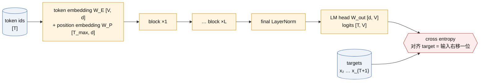
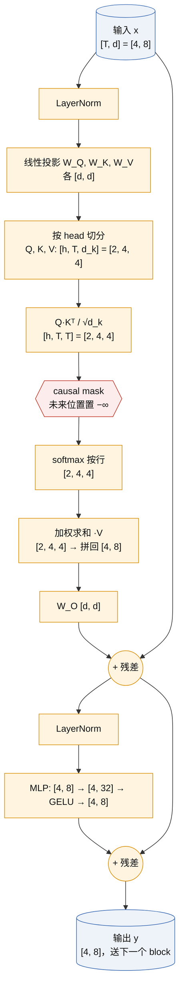

# Transformer decoder 与 next-token objective

一句话定义：把一段 token 序列送进一叠"带 causal mask 的自注意力 + MLP"块，在每个位置预测下一个 token，用交叉熵训练；这是 GPT 全系列共用的底座。

> [!success] Public algorithm
> Transformer 结构（Attention Is All You Need，2017，**非 OpenAI**，前置）与 decoder-only 语言模型的训练目标（GPT-1 论文，2018）都在论文中完整公开，含公式与超参数。

> [!info] Public system behavior
> 无。本卡只涉及论文级算法。

> [!question] Inference
> 参数量近似公式 $N \approx 12 L d^2$ 与 LM head 算力占比是本卡自己的推导，不是论文结论；"MLP 存储事实知识"来自非 OpenAI 的解释性研究，属推断。

> [!danger] Unknown
> GPT-1 的架构、数据集（BooksCorpus）和超参数均已公开。GPT-4 及之后的层数、宽度、是否 weight tying、交叉熵 kernel 实现均未公开，不属于本卡范围。

**本卡结构**：§1～§10 是十个 lens；§11 是学习过程中的追问，按"注意力内部 / MLP / LM head 与词表 / 对照"四组归档；末尾是实验、误解与掌握记录。

## 1. 承接的瓶颈

上一代是 RNN / LSTM 语言模型（非 OpenAI），它的问题是：

- 序列必须逐个 token 顺序计算，无法在时间维度并行，训练慢；
- 长程依赖靠隐状态一路传递，距离一远信息就衰减；
- 每个 NLP 任务各训一个专用模型，表征无法共享，标注数据稀缺时效果差。

Transformer 用注意力让任意两个位置直接连线，一次前向并行处理整段序列；decoder-only 加 next-token 目标，则让"无标注文本"本身成为训练信号，为 [[sentiment-neuron-gpt-1]] 的 pretrain + fine-tune 铺路。

## 2. 核心思想

自顶向下三层：整个模型 → 一个 block → block 里的两种动作。

### 2.1 整个模型：从 token id 到 loss



入口与出口各有一张"词表 × 宽度"的矩阵，索引同一个词表：

| 记号 | 代码里 | shape | 位置 | 用法 |
|---|---|---|---|---|
| W_E | `self.wte` | [V, d] | 入口 | 查表：第 v 行是 token v 的向量 |
| W_P | `self.wpe` | [T_max, d] | 入口 | 查表：第 t 行是位置 t 的向量，只加一次 |
| W_out | `self.lm_head` | [d, V] | 出口 | 点积：第 v 列是 token v 的打分模板 |

GPT-1、GPT-2 做 weight tying：W_out = W_Eᵀ，同一个张量（`lm_head.weight = wte.weight`），没有额外映射。详见 §11.3。

### 2.2 一个 decoder block（B=1，T=4，d=8，h=2）



注：图中是 GPT-2 之后常用的 pre-LN 写法；原始 Transformer 与 GPT-1 是 post-LN（先残差再 LayerNorm）。子层顺序相同。

**逐步 shape 表**（T=4，d=8，h=2，d_k=4，MLP 中间 32；batch 维省略）

最后一列标 KV cache：<mark style="background:#CFE0F5">蓝底 = 写入 cache</mark>，<mark style="background:#FFE4B3">橙底 = 读取 cache</mark>，空白 = 与 cache 无关。只有 K、V 被缓存，Q 不缓存。

| 步 | 运算 | shape 变化 | 参数 | 这一步在做什么 | KV cache |
|---|---|---|---|---|---|
| 0 | 输入 x | [4, 8] | 无 | 4 个 token，每个 8 维 | |
| 1 | LayerNorm | [4, 8] → [4, 8] | γ, β 各 [8] | 每行归一化到均值 0、方差 1 再缩放平移；逐 token，不混 token；作用是数值稳定 | |
| 2 | Q = xW_Q，K = xW_K，V = xW_V | [4, 8] @ [8, 8] → [4, 8]，三次 | 3 × [8, 8] | 每个 token 独立生成三个角色：Q "我在找什么"，K "我有什么可被找到"，V "被找到后我给出什么" | <mark style="background:#CFE0F5">K、V 在这里算出</mark>；Q 用完即弃 |
| 3 | 切 head | [4, 8] → [4, 2, 4] → [2, 4, 4] | 无 | 沿特征维切成 h 段，每个 head 在自己的 d_k 维子空间找关系 | <mark style="background:#CFE0F5">K、V 以 [h, T, d_k] 形状追加进本层 cache</mark>（decode 时每步追加 1 列） |
| 4 | 打分 S = QKᵀ / √d_k | [2, 4, 4] @ [2, 4, 4]ᵀ → [2, 4, 4] | 无 | S[h, i, j] = token i 的 query 与 token j 的 key 的点积，"i 有多想看 j"；除以 √d_k 防止 softmax 饱和 | <mark style="background:#FFE4B3">读全部旧 K</mark>：新 token 的 Q 乘 cache 里 T_cur 个 K |
| 5 | 加 causal mask | [2, 4, 4] + [4, 4] 广播 | 无 | j > i 处加 −∞，禁止看未来 | decode 时新 token 在最后一行，天然只看过去，可省略 mask |
| 6 | softmax（最后一维） | [2, 4, 4] → [2, 4, 4] | 无 | 每行和为 1，被 mask 的项恰好为 0；第 i 行 = "token i 从每个 j ≤ i 各读多少" | |
| 7 | 加权求和 A·V | [2, 4, 4] @ [2, 4, 4] → [2, 4, 4] | 无 | 第 i 行 = 可见 token 的 value 按权重平均。**唯一跨 token 搬运信息的一步** | <mark style="background:#FFE4B3">读全部旧 V</mark>：权重乘 cache 里 T_cur 个 V |
| 8 | 合并 head | [2, 4, 4] → [4, 2, 4] → [4, 8] | 无 | 拼回 d 维 | |
| 9 | W_O | [4, 8] @ [8, 8] → [4, 8] | [8, 8] | 让不同 head 的通道互相混合（逐 token） | |
| 10 | 残差 x + attn | [4, 8] | 无 | 保留原始信息，梯度直通 | |
| 11 | LayerNorm | [4, 8] → [4, 8] | γ, β 各 [8] | 同步 1 | |
| 12 | MLP：W_1 → GELU → W_2 | [4, 8] → [4, 32] → [4, 8] | [8, 32] + [32, 8] | 逐 token 非线性加工，参数占 block 的 2/3 | |
| 13 | 残差 | [4, 8] | 无 | 输出 y，形状与输入相同，所以可以无限叠 | |

参数核对：注意力 4 × 8² = 256，MLP 8 × 32 + 32 × 8 = 512，合计 768 = 12 d²，与 §6 的 $12 L d^2$ 一致（忽略 bias 与 LayerNorm）。

KV cache 一句话：**每一层各有一份 cache，存的是步 2～3 算出并切好 head 的 K 和 V；步 4 读 K，步 7 读 V；其余步骤对新 token 只算一次，不存也不读。** 缓存的是"投影之后"的 K、V 而不是输入 x，所以 decode 时旧 token 完全不用再过步 1～3。

### 2.3 causal mask（T=4）

行 = 当前位置 query，列 = 被看的位置 key。1 表示允许 attend，0 表示置 −∞ 后 softmax 变成 0。

| q \ k | 1 | 2 | 3 | 4 |
|---|---|---|---|---|
| 1 | 1 | 0 | 0 | 0 |
| 2 | 1 | 1 | 0 | 0 |
| 3 | 1 | 1 | 1 | 0 |
| 4 | 1 | 1 | 1 | 1 |

下三角结构保证位置 t 的输出只依赖 $x_{\le t}$，它对 $x_{t+1}$ 的预测在训练时没有偷看答案，一次前向就能同时得到 T 个合法的预测。mask 只需加在步 5，因为其余步骤本来就不跨 token。

### 2.4 两种物理动作

block 的 13 步只有两类：

| 动作 | 步骤 | 参数量 | 算力随什么涨 | 决定什么 |
|---|---|---|---|---|
| **沿 token 维搬运** | 4～7（注意力核心） | 几乎没有 | T² | 看谁、拿多少 |
| **逐 token 加工** | 1、2、3、8、9、10、11、12、13 | 约 12·L·d² 的全部 | T（线性） | 看到之后算什么 |

逐 token 的步骤等价于"对每个 token 跑同一个函数"的 for 循环，token 共用参数；跨 token 的只有步 4 和步 7。残差连接让每个 token 的 d 维向量像一条总线穿过 L 个 block，每层只加增量，不替换。

这个图景在后面反复出现：

- [[scaling-laws]]：参数几乎全在"加工"里，算力却有一部分随 T² 涨，"模型变大"和"上下文变长"是两个成本轴；
- [[codex-agent-loop-compaction]]：搬运要保留全部旧 token 的 K、V（KV cache），这是长上下文吃显存的根源；
- [[gpt-oss-architecture]]：MoE 只把"加工"那一步换成多个专家，"搬运"不动。

## 3. 目标函数与数据

自注意力（Vaswani et al. 2017，非 OpenAI）：

$$
\operatorname{Attention}(Q, K, V) = \operatorname{softmax}\!\left(\frac{QK^\top}{\sqrt{d_k}} + M\right)V,
\qquad
M_{ij} = \begin{cases} 0 & j \le i \\ -\infty & j > i \end{cases}
$$

语言模型目标（GPT-1 论文式 (1)）：

$$
\mathcal{L}_1(\mathcal{U}) = -\sum_{i} \log P(u_i \mid u_{i-k}, \ldots, u_{i-1}; \Theta)
$$

写成每个位置的交叉熵：

$$
\mathcal{L}(\theta) = -\frac{1}{T}\sum_{t=1}^{T} \log \operatorname{softmax}(z_t)_{x_{t+1}},
\qquad z_t = h_t W_{\text{out}} \in \mathbb{R}^{V}
$$

符号说明：

| 记号 | 含义 | 出现在流程的哪一步 |
|---|---|---|
| $u_i$ / $x_t$ | 第 i 个 token | 输入数据 |
| $k$ | 上下文窗口长度（GPT-1 为 512） | 决定 W_P 的行数 |
| $\Theta$ / $\theta$ | 全部可训练参数 | 每步反向传播更新 |
| $Q, K, V$ | query、key、value 矩阵，各 $[T, d_k]$ | block 内线性投影后 |
| $d_k = d / h$ | 每个 head 的维度 | 切 head 时 |
| $M$ | causal mask | softmax 之前 |
| $h_t$ | 位置 t 的最终隐状态，长度 d | final LayerNorm 之后 |
| $z_t$ | 位置 t 的 logits，长度 V | LM head 之后 |
| $V$ | 词表大小 | W_E 与 W_out 的一维 |

数据：GPT-1 用 BooksCorpus（约 7000 本书），无任何标注；训练信号完全来自"下一个 token 是什么"。

## 4. 训练循环

1. 从语料中切一段长度 T+1 的 token；输入取前 T 个，target 取后 T 个（右移一位）；
2. 一次前向：embedding → L 个 block → LM head，得到 [T, V] 的 logits；
3. 对 T 个位置同时算交叉熵取平均（teacher forcing：每个位置的输入都是真实前缀，不是模型自己刚生成的）；
4. 反向传播，AdamW 一步更新；
5. 重复。没有第二阶段，没有人工标签。

## 5. 推理行为

训练是并行的，推理是自回归的：给定前缀，前向一次，取最后一个位置的 logits，采样一个 token，拼到前缀后面，再前向。分两个阶段：

| 阶段 | 主干 | LM head |
|---|---|---|
| 训练 | 全部 B·T 位置 | 全部 B·T 位置 |
| prefill（T_p 个 prompt token） | T_p 个位置，建 KV cache | 1 个位置 |
| decode（每生成 1 个 token） | 1 个位置 + 读 KV cache | 1 个位置 |

- **KV cache**：逐 token 的步骤对新 token 只算一次；跨 token 的步骤要用新 token 的 Q 乘所有旧 token 的 K、V，旧 token 的 K、V 不变，缓存起来即可。
- **cache 在 decode 阶段持续增长，不只在 prefill 生成。** prefill 一次写入 T_p 个位置；之后每生成一个 token，它在每一层都要过步 2 算出自己的 K、V（步 3 切 head 后各 [h, 1, d_k]），追加到该层的 cache 末尾，然后用自己的 Q 对 cache 里全部 T_p + n 个 K 打分。所以第 n 步 decode 的 cache 长度是 T_p + n。Q 不缓存，因为它只在本步用一次。

```text
每层 cache：K [B, h, T_cur, d_k]，V [B, h, T_cur, d_k]，T_cur = T_p + 已生成数
总大小 ≈ 2 × L × T_cur × d × 每元素字节数（每条序列）
GPT-2 small（L=12, d=768，bf16）：每 token 约 2×12×768×2 B ≈ 37 KB；T_cur = 4k 时约 150 MB
```

  这就是长上下文和多并发时显存的主要消耗，也是 [[codex-agent-loop-compaction]] 里 compaction 要压缩的对象。
- **省的不是 K、V 那次投影，而是整个前缀的重新前向。** 一个 token 在一层算 K、V 只要 2·d² 次乘加，确实不大。但第 ℓ 层的 K、V 依赖该 token 在第 ℓ 层的输入 x，而 x 又依赖第 ℓ−1 层对全部 token 的注意力……一路追到底层。没有 cache，要得到旧 token 在每一层的 K、V，就得把旧 token 从 embedding 开始重跑全部 L 层 13 步，代价是每个旧 token 12·L·d²。于是第 n 步 decode 要付 n × 12·L·d²，N 步总量 O(N²)；有 cache 后每步只算新 token 那一份 12·L·d²，总量 O(N)。

```text
GPT-2 small，前缀 1000 token，生成第 1000 个 token 这一步：
  无 cache：1000 × 85M ≈ 85G 次乘加
  有 cache：     1 × 85M + 读 12 层 × 2 × 1000 × 768 ≈ 85M + 18M
```

  K、V 恰好是注意力（唯一跨 token 的步骤）需要从旧 token 那里拿的**全部**信息，所以它们是前缀的"充分统计量"：存下它们，旧 token 的其余一切都可以丢。也可以只缓存每层的 x 再临时投影，显存更小但每步多 2·d²·T_cur 的重投影；主流实现选择缓存 K、V。
- **训练不需要 KV cache。** 训练时 T 个位置一次前向同时算完，每个位置的 K、V 在这一步算出并立刻被同一步的注意力用掉，没有"下一步再用"的需求。autograd 会把它们作为激活值保留到反向传播，但那是单步内的事，不跨步。cache 只在"逐 token 串行生成"时才有意义。例外是 RLHF / 推理 RL 的采样阶段（[[instructgpt-chatgpt]]、[[o1-rl-on-cot]]）：生成 rollout 时用 cache，随后的梯度更新不用。
- **cache 的索引是"位置"，不是 token id。** 每层每 head 的 cache 是按序列位置 0 … T_cur−1 排列的一列 K、V。同一个 token（比如 "the"）出现在位置 3 和位置 50，K、V 完全不同，因为它们是过了 L 层注意力、混入了各自上下文之后的结果，位置信息也已经加在里面。
- **多轮对话默认从第一句重新编码，prefix caching 用来避免。** 对话被序列化成一条长序列：system → user₁ → assistant₁ → user₂ → …。API 是无状态的，每个新请求原则上要把整段历史重新 prefill。但 causal 结构保证：位置 i 的 K、V 只依赖 token ≤ i，所以**只要前缀 token 序列逐位相同，它的 K、V 就逐位相同，可以复用**。实现上把 cache 按前缀分块存起来，用前缀 token 序列（的哈希）做 key，新请求命中多长前缀就跳过多长 prefill，只算新增的 suffix。任何一处改动（哪怕改一个字）会让从那一位开始的全部 cache 失效，所以 system prompt 要放最前、动态内容放最后。

  公开边界：OpenAI API 的 prompt caching 是文档化的 Public system behavior（按前缀命中计费折扣；GPT-5.6 提供显式 cache breakpoint，见 [[function-calling-responses-api]]）；服务端如何存储、淘汰和跨机器共享 cache 未公开。
- **cache 在 token 被"吃进去"的那次前向里更新，不是在它被采样出来之后。** 每步 decode 的顺序是：把上一步采样出的 token 作为输入 → 逐层算它的 K、V 并追加进该层 cache → 该层注意力读 cache → … → LM head → 采样出下一个 token。所以一个 token 的 K、V 进入 cache 的时刻，是它作为输入被处理的那一步，比它被采样出来晚一步；刚采样出的 token 此刻还不在 cache 里。生成 10 个 token 就更新 10 次，每次追加一列，但相位差一。

```text
prefill : 输入 p1..pTp                → cache 长 Tp        → 采样 g1
decode 1: 输入 g1（写入 g1 的 K、V）    → cache 长 Tp+1      → 采样 g2
decode 2: 输入 g2（写入 g2 的 K、V）    → cache 长 Tp+2      → 采样 g3
…
decode n: 输入 gn                      → cache 长 Tp+n      → 采样 g(n+1)
```

  推论：更新发生在同一次前向内部、逐层进行（第 ℓ 层写入后紧接着第 ℓ 层读取），不是前向结束后统一写；最后一个采样出的 token（如 EOS）如果不再送回模型，它的 K、V 永远不会被算。
- **LM head 的代价**：按每个生成 token 计是 d·V，与训练一样，没有省。省的是 prefill 阶段前 T_p − 1 个位置不用算（下一个 token 已知），以及避免朴素实现每步对整个前缀重算 logits 的 O(N²) 冗余。

## 6. Scaling 维度

可放大的量：层数 L、宽度 d、head 数 h、上下文 T、词表 V。

**主干参数量**（推导，忽略 embedding、bias、LayerNorm）：每个 block 有注意力 $4d^2$（W_Q、W_K、W_V、W_O）+ MLP $8d^2$（两层，中间 4d），所以

$$
N \approx 12 L d^2
$$

| 模型 | L | d | h | T | N（公开值） |
|---|---|---|---|---|---|
| GPT-1（2018） | 12 | 768 | 12 | 512 | 117M |
| tiny GPT（E1） | 4 | 128 | 4 | 128 | 0.80M（实测 801,664，含 LayerNorm 与 bias） |

GPT-1 代入公式：12 × 12 × 768² ≈ 85M，加上 40478 × 768 ≈ 31M 的 embedding，约 116M，与公开值一致。

**LM head 算力**（推导）：一个 batch 要算 B·T·V 次长度为 d 的点积，即 B·T·V·d 次乘加；主干每 token 约 12·L·d²。

| 配置 | V | d | LM head / token | 主干 / token | 占比 |
|---|---|---|---|---|---|
| E1（L=4） | 65 | 128 | 8.3k | 786k | ≈ 1% |
| GPT-2 small（L=12） | 50257 | 768 | 38.6M | 85M | ≈ 31% |
| 更大模型 | 固定 | 增大 | 随 d 线性 | 随 L·d² | 持续下降 |

LM head 随 V·d 线性增长，主干随 L·d² 增长，所以词表大小对小模型影响大、对大模型影响小。

## 7. 证据

| 主张 | 证据 | 来源 |
|---|---|---|
| 注意力可替代循环结构并大幅并行 | 机器翻译 BLEU 达到 SOTA 且训练成本更低 | Vaswani et al. 2017（非 OpenAI） |
| decoder-only + next-token 预训练可迁移到 12 个 NLU 任务 | GPT-1 论文 9/12 任务 SOTA | GPT-1 论文 Table 2 |
| 层数越多迁移越好 | GPT-1 论文 Fig. 2 左：转移的层数与下游精度单调关系 | GPT-1 论文 §5 |
| 随机初始化时 loss ≈ ln V | E1 smoke：V=65，loss 4.22 vs ln 65 = 4.17 | [[E1-tiny-gpt]] |

## 8. 局限

- 注意力对 T 是 $O(T^2)$ 的计算与显存，上下文长度受限（GPT-1 为 512）；
- 位置由可学习的 position embedding 编码，无法外推到训练时没见过的长度；
- 目标只是拟合语料分布，不区分"正确"与"常见"，这一点到 [[instructgpt-chatgpt]] 才由 RLHF 处理。

## 9. 后续影响

直接影响 [[sentiment-neuron-gpt-1]]：GPT-1 把这个 decoder 当作预训练底座，再加任务专用的输入变换和 fine-tune。此后 [[gpt-2-zero-shot]]、[[gpt-3-in-context-learning]] 都只改规模和使用方式，不改这个结构与目标。

## 10. 与相关方法的区别

| 维度 | decoder-only（GPT） | encoder-decoder（原始 Transformer） | encoder-only（BERT，非 OpenAI，对照） |
|---|---|---|---|
| mask | causal 下三角 | encoder 无 mask，decoder causal + cross-attn | 无 mask，双向 |
| 训练目标 | next-token | 序列到序列 | masked token 还原 |
| 天然会生成吗 | 是 | 是 | 否 |
| 一次前向的监督信号数 | T 个 | 目标序列长度 | 被 mask 的 15% |

## 11. 追问与澄清

学习过程中的追问（2026-09-13～17），按主题归档。每条先给结论，再给依据。

### 11.1 注意力内部：head 是怎么切、怎么合的

**切 head 沿特征维切 Q、K、V 三者，不沿 token 维切。** V 是 [4, 8]，head 0 拿左 4 列，head 1 拿右 4 列：

```text
V = [ v1_0 v1_1 v1_2 v1_3 | v1_4 v1_5 v1_6 v1_7 ]   ← token 1
    [ v2_0 v2_1 v2_2 v2_3 | v2_4 v2_5 v2_6 v2_7 ]   ← token 2
    [ v3_0 v3_1 v3_2 v3_3 | v3_4 v3_5 v3_6 v3_7 ]   ← token 3
    [ v4_0 v4_1 v4_2 v4_3 | v4_4 v4_5 v4_6 v4_7 ]   ← token 4
           head 0 (4 列)        head 1 (4 列)
```

每个 head 仍看到全部 token，只是每个 token 只给它 d_k 维。两种等价写法：先算 x @ W_V 再 reshape（代码常见）；或把 W_V 视为 h 个 [d, d_k] 拼接，每个 head 各自投影（论文写法）。不能沿 token 切，否则某个 head 看不到部分位置。

**head 之间零交流。** 步 4 是沿 head 维的批量矩阵乘：head 0 的 Q 只乘 head 0 的 K，得到互不相干的 h 张 [T, T] 分数表；步 5～7 也各自在本 head 内完成。多头注意力等价于 h 个独立的小注意力并联。

**W_O 是唯一让 head 相遇的地方。** 步 8 拼接后每个 token 是 [a0 a1 a2 a3 | b0 b1 b2 b3]，W_O 输出的每一维都是这 8 个数的加权和：

```text
out_i[k] = a0·W[0,k] + … + a3·W[3,k] + b0·W[4,k] + … + b3·W[7,k]
```

等价于 `out_i = head0_i @ W_O⁰ + head1_i @ W_O¹`，"对 head 求和"就是混合。没有 W_O 的话，残差流的通道会被绑死在某个 head 上。W_O 仍是逐 token 的，混的是同一 token 内的通道。

### 11.2 MLP：为什么要逐 token 的非线性加工

三层理由，前两条是算法层面，第三条是解释性研究的推断。

1. **没有它，block 几乎是线性的。** 注意力输出 = A·V，V = xW_V，对 x 而言除了 A 里的 softmax 之外全是线性映射；只叠注意力无法对搬来的信息做"计算"（比如判断两个特征是否同时出现）。GELU 提供逐 token 的非线性。
2. **搬运和加工分开，加工可完全并行。** 注意力决定"看谁"，MLP 决定"看到之后算什么"；加工不跨 token，成本随 T 线性，是最便宜的加非线性方式。
3. **容量在这里。** 先升到 4d 再降回 d，参数占 block 的 2/3。解释性研究（Geva et al. 2021 等，非 OpenAI，推断）把 MLP 看成 key–value 记忆：W_1 的列是模式检测器，GELU 后只有被触发的模式留下，W_2 的对应行把关联内容写回残差流。"事实性知识主要在 MLP"是这类研究的推断，不是 GPT 论文的结论。

可验证：E1 去掉 MLP 只留注意力，同参数量下对比 loss。

### 11.3 LM head 与词表

**注意力分数不是 logits。** 模型里有两处 softmax：

| | 注意力分数（步 4） | logits（LM head 输出） |
|---|---|---|
| shape | [B, h, T, T] | [B, T, V] |
| 含义 | token i 对 token j 的相似度 | 位置 t 对词表每个 token 的打分 |
| softmax 沿哪一维 | key 位置 j，长度 T | 词表，长度 V |
| softmax 后 | 注意力权重，用来加权 V | 下一个 token 的概率分布 |
| loss 直接作用吗 | 否，中间量 | 是，交叉熵算在这里 |
| 出现次数 | 每层每 head 一张 | 整个模型最后一次 |

混淆的后果是以为 loss 直接训练注意力权重；实际上梯度先落在 logits 上，经 W_O、V、softmax 反传才到注意力分数，注意力模式是间接学出来的。E1 填空时把 logits 用 d 而非 V 摊平，就是把这两个轴混了。

**logit 是隐状态与词向量的点积。** `z_t[v] = h_t · W_out[:, v]`，一次 [B·T, d] @ [d, V] 矩阵乘得到全部位置的 logits。tie 时 W_out = W_Eᵀ，logit 就是"当前位置的向量"与"候选词 embedding"的相似度；代价是最后一层的 h_t 必须落到与输入 embedding 同一空间，由最后一个 block 和 final LayerNorm 完成适配。后来许多模型不 tie；OpenAI 闭源模型未知，gpt-oss 配置待 D4 核对。

**分母 Z = Σ exp(z_v) 用精确 softmax，不做近似。** 工程上解决四件事：

| 问题 | 做法 | 公开边界 |
|---|---|---|
| 数值溢出 | log-sum-exp：`log Z = m + log Σ exp(z_v − m)`，损失写成 `log Z − z_target` | 通用数值方法 |
| 算力 | 稠密矩阵乘，占比见 §6，最多三成 | 从公开超参数推算 |
| 显存 | logits、概率、梯度三者都是 [B·T, V]，大词表下比模型激活值还大（16k token × 128k 词表 fp32 ≈ 8 GB/份） | 见下 |
| 多卡 | 词表切到多张 GPU，各算局部 max 与局部和，all-reduce 两个标量 | Megatron-LM（NVIDIA，非 OpenAI） |

显存分四层解决：micro-batch + 梯度累积（全局 batch 从不一次物化）；bf16 存 logits、fp32 累加；反向重算不存概率（前向只留 log Z 与 target logit，反向用 `p_v − 1[v=target]` 重建梯度，梯度需要全部 V 个概率，所以只能重算不能只存一项）；沿 V 和 B·T 双向分块 + 在线 log-sum-exp（`m = max(m₁, m₂)`，`l = l₁·e^{m₁−m} + l₂·e^{m₂−m}`，与 FlashAttention 同一技巧，把 LM head 显存从 O(B·T·V) 降到 O(B·T + chunk)）。融合交叉熵 kernel（Liger、Apple Cut Cross-Entropy）均为非 OpenAI 公开实现；OpenAI 训练栈未公开。

历史上的近似方法（hierarchical / sampled softmax、NCE、adaptive softmax）是 RNN 时代算力不足的产物，现代 LLM 预训练不用。

### 11.4 对照：head 切分与 token mixer（MLP-Mixer、MetaFormer，非 OpenAI）

MetaFormer 把 block 抽象成 token mixer（沿 token 维混合）+ channel mixer（逐 token 加工），与 §2.4 的两种动作一一对应。切 head 在这个框架里是对通道分组：h 组，每组 d_k 通道共用一个 [T, T] 混合矩阵。

| 方法 | 混合矩阵 [T, T] 从哪来 | 通道分组 | 变长 / causal |
|---|---|---|---|
| 多头注意力 | 输入算出 softmax(QKᵀ)，每 head 一个，每样本不同 | h 组 | 能，加 mask 即 causal |
| MLP-Mixer token-mixing | 学出的固定参数，与输入无关 | 全通道共用 | 不能，T 写死在参数形状里 |
| PoolFormer 池化 | 固定平均池化，无参数 | 全通道共用 | 能变长，只有局部邻域 |

结论：head 切分只是分组 token mixer；注意力独特之处是混合矩阵由输入动态生成，这带来任意长度与天然 causal，也带来 O(T²)。只作机制对照，不用于推断 OpenAI 实现。

## 最小示例或实验

对应实验：[[E1-tiny-gpt]]（`experiments/pretraining/tiny_gpt/`）。model.py 的注释按 §2.2 的 13 步标注 shape；两处填空是 causal mask（§2.3）与交叉熵（§3）。

## 常见误解

- "causal mask 是防止信息泄漏"：更准确地说，它让位置 t 的表示只依赖 $x_{\le t}$，从而训练时的 T 个预测在推理时都可复现；
- "fine-tune 的好处是省算力"：核心是无标注数据学到的表征迁移，省算力是副产品；
- 把 softmax 前的 −∞ 理解为"删掉"：矩阵形状不变，只是权重变 0；
- 把 softmax 当 hardmax：e⁰ = 1 不是 0，所有 logit 都有正概率，这正是梯度的来源；
- 把隐状态维 d 和词表维 V 混用：logits 摊平要用 `logits.size(-1)`；
- "生成时 LM head 更便宜"：每个生成 token 的 LM head 代价与训练相同，省的只是 prefill 与冗余重算。

## 我曾经答错的地方

- 2026-09-13 诊断：说不出 block 的子层顺序和 Q/K/V 的 shape；把 fine-tune 的核心差异说成计算量减少。
- 2026-09-16 作业：target 序列写错（应为 input 右移一位）；softmax 算成 hardmax，交叉熵随之算错（正确值 0.878）。
- 2026-09-17 E1：logits 用 d 而非 V 摊平，自行修正。

## 掌握证据

- 2026-09-13 诊断 correctness 2 → mastery 1。
- 2026-09-16 作业 correctness 2、algorithmic_mechanism 2 → mastery 保持 1；causal mask、softmax 权重、"一次前向 T 个预测"已掌握。softmax + CE 重做通过。
- 2026-09-17 E1 第一阶段：自行填 causal mask 与交叉熵，4090 smoke 通过（初始 loss 4.22 ≈ ln 65）。
- 自发总结出 §2.4 的"搬运 / 加工"图景，并追问到 LM head 的代价结构（§11.3），说明数据流层面已能自己推。
- 待完成：09-23 复测 block 结构（第二档填空）；E1 第二阶段随 A2。

## 待验证内容

- gpt-oss 是否 weight tying（D4 时查公开配置）。
- E1 消融：去掉 MLP 只留注意力的 loss 对比（可选）。

← [[A-pretraining-scaling]]
