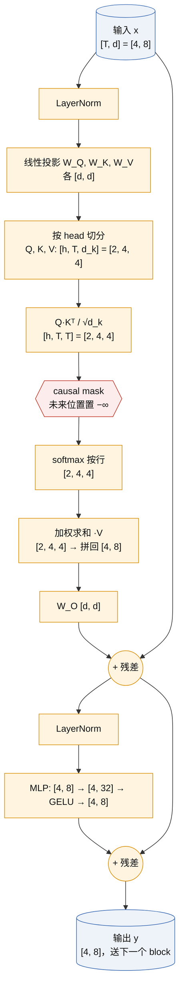
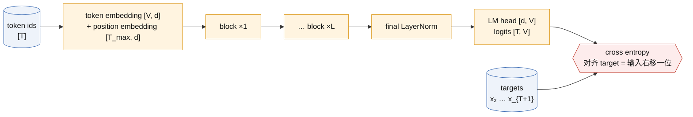

# Transformer decoder 与 next-token objective

一句话定义：把一段 token 序列送进一叠"带 causal mask 的自注意力 + MLP"块，在每个位置预测下一个 token，用交叉熵训练；这是 GPT 全系列共用的底座。

> [!success] Public algorithm
> Transformer 结构（Attention Is All You Need，2017，**非 OpenAI**，前置）与 decoder-only 语言模型的训练目标（GPT-1 论文，2018）都在论文中完整公开，含公式与超参数。

> [!info] Public system behavior
> 无。本卡只涉及论文级算法。

> [!question] Inference
> 参数量近似公式 $N \approx 12 L d^2$ 是本卡自己的推导，不是论文结论；GPT-3 论文用了类似的忽略 embedding 的近似。

> [!danger] Unknown
> 无。GPT-1 的架构、数据集（BooksCorpus）和超参数均已公开。后续 GPT-4 及之后的具体层数、宽度未公开，不属于本卡范围。

## 1. 承接的瓶颈

上一代是 RNN / LSTM 语言模型（非 OpenAI），它的问题是：

- 序列必须逐个 token 顺序计算，无法在时间维度并行，训练慢；
- 长程依赖靠隐状态一路传递，距离一远信息就衰减；
- 每个 NLP 任务各训一个专用模型，表征无法共享，标注数据稀缺时效果差。

Transformer 用注意力让任意两个位置直接连线，一次前向并行处理整段序列；decoder-only 加 next-token 目标，则让"无标注文本"本身成为训练信号，为 [[sentiment-neuron-gpt-1]] 的 pretrain + fine-tune 铺路。

## 2. 核心思想

### 图 1：一个 decoder block 的数据流（B=1，T=4，d=8，h=2）



注：图中是 GPT-2 之后常用的 pre-LN 写法；原始 Transformer 与 GPT-1 是 post-LN（先残差再 LayerNorm）。两者子层顺序相同。

#### 图 1 逐步说明（T=4，d=8，h=2，d_k=4，MLP 中间 4d=32；batch 维省略，实际前面还有 B）

| 步   | 运算                         | 输入 shape → 输出 shape                                    | 参数                | 这一步在做什么                                                                                         |     |
| --- | -------------------------- | ------------------------------------------------------ | ----------------- | ----------------------------------------------------------------------------------------------- | --- |
| 0   | 输入 x                       | [4, 8]                                                 | 无                 | 4 个 token，每个是 8 维向量                                                                             |     |
| 1   | LayerNorm                  | [4, 8] → [4, 8]                                        | γ, β 各 [8]        | 每一行各自归一化到均值 0、方差 1，再缩放平移。逐 token 操作，token 之间不交换信息；作用是让训练稳定                                      |     |
| 2   | Q = xW_Q，K = xW_K，V = xW_V | [4, 8] @ [8, 8] → [4, 8]，三次                            | 3 × [8, 8]        | 每个 token 生成三个角色：Q "我在找什么"，K "我有什么可被找到"，V "被找到后我给出什么"                                            |     |
| 3   | 切 head                     | [4, 8] → [4, 2, 4] → 转置 [2, 4, 4]                      | 无                 | 把 8 维切成 2 段各 4 维，每个 head 用自己的 4 维子空间找不同类型的关系                                                    |     |
| 4   | 打分 S = QKᵀ / √d_k          | [2, 4, 4] @ [2, 4, 4]ᵀ → [2, 4, 4]                     | 无                 | S[h, i, j] 是 token i 的 query 和 token j 的 key 的点积，即"i 有多想看 j"。除以 √4 = 2 让方差不随 d_k 增大，softmax 不饱和 |     |
| 5   | 加 causal mask              | [2, 4, 4] + [4, 4] 广播 → [2, 4, 4]                      | 无                 | j > i 的位置加 −∞，禁止看未来                                                                             |     |
| 6   | softmax（最后一维）              | [2, 4, 4] → [2, 4, 4]                                  | 无                 | 每一行变成和为 1 的权重，被 mask 的项恰好为 0。第 i 行 = "token i 从每个 j ≤ i 各读多少"                                   |     |
| 7   | 加权求和 A·V                   | [2, 4, 4] @ [2, 4, 4] → [2, 4, 4]                      | 无                 | 第 i 行输出 = 可见 token 的 value 向量按权重平均。这是唯一让 token 之间交换信息的一步                                        |     |
| 8   | 合并 head                    | [2, 4, 4] → [4, 2, 4] → [4, 8]                         | 无                 | 把两个 head 的 4 维结果拼回 8 维                                                                          |     |
| 9   | W_O                        | [4, 8] @ [8, 8] → [4, 8]                               | [8, 8]            | 让不同 head 的结果互相混合                                                                                |     |
| 10  | 残差 x + attn                | [4, 8]                                                 | 无                 | 保留原始信息，梯度有直通路径；深层网络才训得动                                                                         |     |
| 11  | LayerNorm                  | [4, 8] → [4, 8]                                        | γ, β 各 [8]        | 同步 1                                                                                            |     |
| 12  | MLP：W_1，GELU，W_2           | [4, 8] @ [8, 32] → [4, 32] → GELU → @ [32, 8] → [4, 8] | [8, 32] + [32, 8] | 逐 token 的非线性加工，token 之间不交换。参数占 block 的 2/3，一般认为事实性知识主要存在这里                                      |     |
| 13  | 残差                         | [4, 8]                                                 | 无                 | 输出 y，送下一个 block                                                                                 |     |

参数核对：注意力 4 × 8² = 256，MLP 8 × 32 + 32 × 8 = 512，合计 768 = 12 d²，与第 6 节的 $12 L d^2$ 一致（忽略 bias 与 LayerNorm）。

分工记忆：**注意力子层横向混 token，MLP 子层纵向加工每个 token；两者都带残差，LayerNorm 只做数值稳定。**

#### 一句话物理图景（2026-09-15，用户确认的总结）

整个 block 只有两种物理动作：

| 动作 | 步骤 | 参数量 | 算力随什么涨 | 决定什么 |
|---|---|---|---|---|
| **沿 token 维搬运** | 4～7（注意力） | 几乎没有（投影矩阵算在特征变换里） | T² | 看谁、拿多少 |
| **逐 token 非线性加工** | 12（MLP），以及 1、2、9 等线性/归一化步 | 约 12·L·d² 的全部 | T（线性） | 看到之后算什么 |

残差连接让每个 token 的 d 维向量像一条总线穿过 L 个 block，每层只往上加增量，不替换。

这个图景在后面反复出现：
- [[scaling-laws]]：参数几乎全在"加工"里，算力却有一部分随 T² 涨，所以"模型变大"和"上下文变长"是两个成本轴；
- [[codex-agent-loop-compaction]]：搬运要保留全部旧 token 的 K、V（KV cache），这是长上下文吃显存的根源，也是 compaction 要解决的问题；
- [[gpt-oss-architecture]]：MoE 只把"加工"那一步换成多个专家，"搬运"不动。

#### 两个追问（2026-09-13）

**追问 1：切 head 是把 V 切开吗？**

是，但 Q、K、V 三个都切，而且沿特征维（列）切，不沿 token 维（行）切。V 是 [4, 8]，head 0 拿左 4 列，head 1 拿右 4 列，堆成 [2, 4, 4]：

```text
V = [ v1_0 v1_1 v1_2 v1_3 | v1_4 v1_5 v1_6 v1_7 ]   ← token 1
    [ v2_0 v2_1 v2_2 v2_3 | v2_4 v2_5 v2_6 v2_7 ]   ← token 2
    [ v3_0 v3_1 v3_2 v3_3 | v3_4 v3_5 v3_6 v3_7 ]   ← token 3
    [ v4_0 v4_1 v4_2 v4_3 | v4_4 v4_5 v4_6 v4_7 ]   ← token 4
           head 0 (4 列)        head 1 (4 列)
```

每个 head 仍然看到全部 token，只是每个 token 只给它 d_k 维。两种等价写法：先算 x @ W_V 得 [4, 8] 再 reshape 成 [4, 2, 4] 并转置（代码常见）；或把 W_V 视为两个 [8, 4] 拼接，每个 head 各自投影（论文写法）。不能沿 token 切，否则某个 head 看不到部分位置，注意力"任意位置互看"就失效。

**追问 2：第 2 步是每个 token 独立映射到自己的 Q、K、V 吗？**

是。Q = x @ W_Q 的第 i 行只用了 x 的第 i 行，等价于对每个 token 做同一个线性映射的 for 循环；4 个 token 共用同一套 W_Q、W_K、W_V。由此把 block 的 13 步分成两类：

| 逐 token 独立（可看成 for 循环） | 跨 token 交互 |
|---|---|
| 步 1、11 LayerNorm | 步 4 打分 QKᵀ |
| 步 2 Q/K/V 投影 | 步 7 加权求和 A·V |
| 步 3、8 切 head / 合并 head | |
| 步 9 W_O | |
| 步 10、13 残差 | |
| 步 12 MLP | |

推论：causal mask 只需加在第 5 步，因为其他步骤本来就不会把未来 token 的信息带过来。推理时新 token 的逐 token 步骤只算一次，跨 token 步骤要用新 token 的 Q 乘所有旧 token 的 K、V；旧 token 的 K、V 不变，缓存起来就是 KV cache。

**追问 3：切 head 和 token mixer 类方法（MLP-Mixer、MetaFormer，非 OpenAI，对照）像不像？**

像的地方在框架，不像的地方在混合矩阵怎么来。

MLP-Mixer / MetaFormer（非 OpenAI）把一个 block 抽象成两步：**token mixer** 沿 token 维混合信息，**channel mixer** 沿特征维逐 token 加工。套到 decoder block 上：注意力（步 4～7）就是 token mixer，MLP（步 12）就是 channel mixer，与上面的"跨 token / 逐 token"两列一一对应。

切 head 在这个框架里是**对通道分组**：把 d 个通道分成 h 组，每组 d_k 个通道共用一个 [T, T] 的混合矩阵 A_h。对比三种 token mixer：

| 方法 | 混合矩阵 [T, T] 从哪来 | 通道分组 | 能否变长 / causal |
|---|---|---|---|
| 多头注意力 | 由输入算出（softmax(QKᵀ)），每个 head 一个，每个样本不同 | h 组，每组 d_k 通道 | 能：矩阵随 T 现算，加 mask 即 causal |
| MLP-Mixer token-mixing MLP | 学出来的固定参数，与输入无关 | 所有通道共用同一个矩阵（相当于 h=1 且权重静态） | 不能：T 固定进参数形状；无天然 causal |
| PoolFormer 池化 | 固定的平均池化，无参数 | 全部通道共用 | 能变长，但只有局部邻域 |

所以：**head 切分 ≈ 分组 token mixer；注意力的独特之处不是分组，而是混合矩阵 A 由输入动态生成**。这一点决定了它能处理任意长度、能做 causal 语言模型，也决定了 O(T²) 的代价。Mixer 类方法主要在视觉里做对照实验，没有成为语言模型主线。

公开边界：MLP-Mixer、MetaFormer 均为非 OpenAI 论文，此处只作机制对照，不用于推断 OpenAI 任何模型的实现。

**追问 4（2026-09-15）：一个 head 的 Q、K 只在本 head 内算分数吗？**

是。步 4 的 [2, 4, 4] @ [2, 4, 4]ᵀ 是沿 head 维的批量矩阵乘：head 0 的 Q [4, 4] 只乘 head 0 的 K [4, 4]ᵀ，head 1 同理，得到两张互不相干的 4×4 分数表；步 5～7 的 mask、softmax、乘 V 也各自在本 head 内完成。两个 head 在整个注意力计算中零交流，唯一让它们相遇的是步 8 拼接后的步 9 W_O [8, 8]，它把 head 0 的 4 维输出和 head 1 的 4 维输出线性混合。所以多头注意力等价于 h 个独立的小注意力并联，再用 W_O 汇总。

**追问 5（2026-09-15）：步 9 "让不同 head 的结果互相混合"是什么意思？**

步 8 拼接后，每个 token 是一个 8 维向量，前 4 维来自 head 0，后 4 维来自 head 1：

```text
token i 拼接后:  [ a0 a1 a2 a3 | b0 b1 b2 b3 ]
                    head 0 输出     head 1 输出
```

W_O 是 [8, 8]，输出的每一维都是这 8 个数的加权和：

```text
out_i[k] = a0·W[0,k] + a1·W[1,k] + a2·W[2,k] + a3·W[3,k]
         + b0·W[4,k] + b1·W[5,k] + b2·W[6,k] + b3·W[7,k]
```

即输出的第 k 维同时用到 head 0 和 head 1 的信息，这就是"混合"。如果没有 W_O，输出的 0～3 维永远只装 head 0 的结果，4～7 维永远只装 head 1 的结果，残差流的每个通道被绑定到某个 head 上。

等价写法：把 W_O 按行切成两块 W_O^0、W_O^1（各 [4, 8]），则

```text
out_i = head0_i @ W_O^0 + head1_i @ W_O^1
```

"对 head 求和"这一步就是混合。注意步 9 仍然是逐 token 的：它混的是同一个 token 内不同 head 的通道，不混 token。

**追问 6（2026-09-15）：步 12 为什么要设计一个逐 token 的非线性加工？**

三层理由，前两条是公开算法层面的，第三条是解释性研究的推断。

1. **没有它，block 几乎是线性的。** 注意力输出 = 权重表 A 乘 V，而 V = xW_V，所以对 x 而言除了 A 里的 softmax 之外全是线性映射。若只叠注意力，多层能表达的函数仍接近"用动态权重做线性组合"，无法对搬运来的信息做任何"计算"（比如判断两个特征是否同时出现）。MLP 的 GELU 提供了逐 token 的非线性，让每个位置能把收集到的信息加工成新特征。
2. **分工明确、可并行。** 搬运（注意力）负责决定"看谁"，加工（MLP）负责决定"看到之后算什么"。加工不需要跨 token，所以做成逐 token 独立、可完全并行的形式，成本只随 T 线性增长，是最便宜的加非线性方式。
3. **容量在这里。** 先升维到 4d 再降回 d，参数占 block 的 2/3。解释性研究（Geva et al. 2021 等，非 OpenAI，推断）把 MLP 看成 key–value 记忆：第一层 W_1 的每一列是一个"模式检测器"，GELU 之后只有被触发的模式留下，第二层 W_2 的对应行把该模式关联的内容写回残差流。事实性知识主要存在这里，是这类研究的推断，不是 Transformer 或 GPT 论文的结论。

验证方式：E1 里去掉 MLP 只留注意力，对比同参数量下的 loss；这属于"可复现实验"级证据。

**追问 7（2026-09-16）：注意力分数就是 logits 吗？**

不是。模型里有两处 softmax，各自的输入是两种不同的东西：

| | 注意力分数（步 4） | logits（LM head 输出） |
|---|---|---|
| shape | [B, h, T, T] | [B, T, V] |
| 含义 | token i 对 token j 的相似度 | 位置 t 对词表中每个 token 的打分 |
| softmax 沿哪一维 | 沿 key 位置 j（长度 T） | 沿词表（长度 V） |
| softmax 后是什么 | 注意力权重，用来加权 V | 下一个 token 的概率分布 |
| 有没有 loss 直接作用 | 没有，只是中间量 | 有，交叉熵就算在这里 |
| 出现次数 | 每层每个 head 一张 | 整个模型只有最后一次 |
| 作业对应 | 第 3 题 | 第 4 题 |

共同点只是"都是 softmax 之前的实数"，所以广义上都可以叫 pre-softmax score；但在语言模型的语境里，"logits"专指 LM head 输出的词表打分。混淆的后果：会误以为 loss 直接训练注意力权重。实际上梯度先落在 logits 上，再反传经过 W_O、V、softmax 才到达注意力分数，注意力模式是间接学出来的。

**追问 8（2026-09-17）：词表很大时，每个词的 logit 是输出向量与词 embedding 的点积吗？分母怎么高效算？**

*第一问：是。* LM head 是一个 [d, V] 矩阵 W_out，位置 t 的最终隐状态 h_t 是 [d]，则

```text
z_t[v] = h_t · W_out[:, v]        对词表中每个 v，共 V 个点积
z_t     = h_t @ W_out             一次 [d] @ [d, V] 的矩阵乘
```

GPT-1、GPT-2 都做 weight tying：W_out = W_E^T，即输出矩阵就是输入 token embedding 表。于是 logit 恰好是"当前位置的向量"与"候选词的 embedding"的点积，相似度越高打分越高。E1 的 model.py 也这样写（`lm_head.weight = wte.weight`）。

*第二问：分母 Z = Σ_v exp(z_v)。* 主流 GPT 训练用**精确 softmax**，不做近似；工程上解决三个问题：

| 问题 | 做法 | 公开边界 |
|---|---|---|
| 数值溢出 | log-sum-exp：`log Z = m + log Σ exp(z_v − m)`，m = max_v z_v；损失写成 `−log p = log Z − z_target`，从不显式算 exp 后再取 log | 通用数值方法 |
| 算力 | 就是一次 [B·T, d] @ [d, V] 的稠密矩阵乘，GPU 上效率很高。占比：GPT-2 small d=768、V=50257 时每 token 约 d·V ≈ 39M 乘加，主干约 12·L·d² ≈ 85M，占三分之一；模型变大后 d² L 项增长更快，LM head 占比下降 | 从公开超参数推算 |
| 显存 | 完整 logits [B·T, V] 很大（1M token × 128k 词表 × 4 字节 ≈ 512 GB）。做法是**分块 + 在线 log-sum-exp**：把 V 切成若干块，每块算局部 (m_i, l_i)，按 `m = max(m_1, m_2)`，`l = l_1·e^{m_1−m} + l_2·e^{m_2−m}` 合并，反向时重算，永不物化整张 logits。这和 FlashAttention 的在线 softmax 是同一个技巧 | 分块/融合交叉熵的公开实现来自非 OpenAI 社区（如 Liger、Apple 的 Cut Cross-Entropy）；OpenAI 训练用什么未公开 |
| 多卡 | 把 V 沿词表切到多张 GPU（vocab parallel），每卡算局部 max 与局部和，all-reduce 两个标量即可得到全局 log Z | Megatron-LM（NVIDIA，非 OpenAI） |

历史上的近似方法（hierarchical softmax、sampled softmax、NCE、adaptive softmax）是 RNN 时代 GPU 算力不足时的产物，现代 LLM 预训练不用，因为精确 softmax 的矩阵乘已足够便宜，而近似会引入偏差。

一个可自查的小点：反向传播时 ∂loss/∂z_v = p_v − 1[v = target]，所以梯度需要全部 V 个概率，这就是为什么分块方法要在反向时重算而不是只存 target 那一项。

*补充（2026-09-17）：W_out 是不是要把 token embedding 再变换一次？*

不是。W_out 就是 LM head 那一个矩阵，本身不对 embedding 做任何变换：

- **不 tie** 时：W_out 是一个独立的 [d, V] 参数，与 W_E 无关，多 d·V 个参数；
- **tie** 时：W_out 和 W_E 是**同一个张量**（代码里 `lm_head.weight = wte.weight`），没有额外映射。GPT-1 论文式 (2) 直接写 `P(u) = softmax(h_n · W_e^T)`，GPT-2 同样。

tie 的含义是"输入端查表用的那 V 个向量，输出端拿来当打分模板"。代价是模型必须让最后一层的 h_t 落到与输入 embedding 同一个空间里，这个适配由最后一个 block 和 final LayerNorm 完成，不需要额外矩阵。后来许多模型改为不 tie；OpenAI 闭源模型是否 tie 未公开，gpt-oss 的公开配置可在 D4 时核对。

*补充：整段序列 T 个位置、再乘 batch B，softmax 的显存是不是太大？*

先纠正一个点：不是"算 T 次"，而是一次矩阵乘 `[B·T, d] @ [d, V]` 同时得到全部位置的 logits，算力上没问题。问题确实在显存，因为 logits、softmax 概率、以及它的梯度三者都是 [B·T, V]：

| 场景 | B·T | V | 单份 fp32 logits |
|---|---|---|---|
| E1 | 64 × 128 = 8k | 65 | 2 MB，可忽略 |
| 单卡 micro-batch | 8 × 2048 = 16k | 128k | 8 GB；加概率与梯度约 24 GB |
| GPT-3 论文的全局 batch | 3.2M tokens | 50k | 640 GB，任何单卡都放不下 |

解决办法分四层，前三层是通用工程，第四层是前面说的分块：

1. **micro-batch + 梯度累积**：全局 batch 从不一次物化，每卡每步只处理一小段 B·T，梯度累加后再更新。这是"大 batch"能训练的前提，与 LM head 无关；
2. **低精度存储**：logits 用 bf16 存，只在 kernel 内部用 fp32 累加求和；
3. **反向重算，不存概率**：前向只保留每行的 log Z（一个标量）和 target 的 logit，反向时重新算一遍 exp，用 `p_v − 1[v = target]` 生成梯度；
4. **沿 V 和沿 B·T 双向分块 + 在线 log-sum-exp**：任何时刻只在显存里放一块 [chunk_tokens, chunk_vocab] 的 logits，用前文的 (m, l) 合并规则拼出完整 log Z。这就是融合交叉熵 kernel 做的事，把 LM head 的显存从 O(B·T·V) 降到 O(B·T + chunk)。

四层叠加后，LM head 不再是显存瓶颈；长上下文下真正的瓶颈回到注意力的 KV cache 和激活值，那是 [[codex-agent-loop-compaction]] 和 FlashAttention 类方法（非 OpenAI）要解决的问题。

公开边界同上：这些都是社区公开工程；OpenAI 训练栈的具体实现未公开。

*补充：W_E 和 W_out 分别是什么？*

两个都是"词表大小 × 模型宽度"的矩阵，一个在模型入口，一个在出口，索引的是同一个词表（E1 里是 65 个字符，GPT-2 里是 50257 个 BPE token）：

| 记号 | 代码里 | shape | 在哪一步 | 用法 |
|---|---|---|---|---|
| W_E | `self.wte`（token embedding） | [V, d] | 图 2 最左：token id → 向量 | 查表：第 v 行就是 token v 的 d 维向量 |
| W_out | `self.lm_head`（LM head） | [d, V] | 图 2 最右：向量 → logits | 点积：第 v 列是 token v 的"打分模板" |

同一个 token v 在 W_E 里占一行、在 W_out 里占一列。tie 就是让这一行和这一列是同一组数字（W_out = W_Eᵀ），所以 GPT-1 论文写成 h·W_eᵀ。位置 embedding W_P（`self.wpe`，[T_max, d]）与二者无关，只在入口加一次。

*补充：一个 batch 的 LM head 要算多少次点积？*

是 B·T·V 次，每次点积长度 d，所以乘加次数是 B·T·V·d（FLOPs 约为其 2 倍）。与主干对比（主干每 token 约 12·L·d² 次乘加）：

| 配置 | B·T | V | d | LM head 乘加 | 主干乘加 | LM head 占比 |
|---|---|---|---|---|---|---|
| E1（L=4, d=128） | 8192 | 65 | 128 | 8192 × 65 × 128 ≈ 68M | 8192 × 786k ≈ 6.4G | ≈ 1% |
| GPT-2 small（L=12, d=768） | 每 token | 50257 | 768 | 38.6M / token | 85M / token | ≈ 31% |
| 更大模型 | 每 token | 固定 | d 增大 | 随 d 线性 | 随 L·d² 增长 | 持续下降 |

结论：LM head 的算力随 V·d 线性增长，主干随 L·d² 增长，所以词表大小对小模型影响大、对大模型影响小。

*补充：生成时"只对最后一个位置算 LM head"到底省了什么？*

用户追问：每一步都算一次，N 步下来不还是 N 次吗？对，**按每个生成 token 计，LM head 的代价是 d·V，训练和生成一样，没有省**。前面"代价更低"说得不准确，省的是另外两处：

1. **prefill 阶段**：prompt 有 T_p 个 token，主干要对它们全部前向（建 KV cache），但 LM head 只需对最后一个位置算，因为前 T_p − 1 个位置的下一个 token 已经知道。省下 (T_p − 1)·d·V；
2. **避免重复计算**：朴素实现每步把整个前缀重新前向并对所有位置算 logits，第 n 步就是 n·d·V，N 步总量 O(N²·d·V)。只算最后一个位置后总量回到 O(N·d·V)。主干那边对应的省法就是 KV cache。

生成过的 token 的 logits 在它被采样的那一步已经用完，后续不再需要，所以"每步一个位置"是无冗余的最小量。

| 阶段 | 主干 | LM head |
|---|---|---|
| 训练 | 全部 B·T 位置 | 全部 B·T 位置 |
| prefill（T_p 个 prompt token） | T_p 个位置 | 1 个位置 |
| decode（每生成 1 个 token） | 1 个位置 + 读 KV cache | 1 个位置 |

### 图 2：整个模型（从 token id 到 loss）



### 图 3：causal mask（T=4）

行 = 当前位置 query，列 = 被看的位置 key。1 表示允许 attend，0 表示置 −∞ 后 softmax 变成 0。

| q \ k | 1 | 2 | 3 | 4 |
|---|---|---|---|---|
| 1 | 1 | 0 | 0 | 0 |
| 2 | 1 | 1 | 0 | 0 |
| 3 | 1 | 1 | 1 | 0 |
| 4 | 1 | 1 | 1 | 1 |

下三角结构保证：位置 t 的输出只依赖 $x_{\le t}$，因此它对 $x_{t+1}$ 的预测在训练时没有偷看答案，一次前向就能同时得到 T 个合法的预测。

## 3. 目标函数与数据

自注意力（Vaswani et al. 2017，非 OpenAI）：

$$
\operatorname{Attention}(Q, K, V) = \operatorname{softmax}\!\left(\frac{QK^\top}{\sqrt{d_k}} + M\right)V,
\qquad
M_{ij} = \begin{cases} 0 & j \le i \\ -\infty & j > i \end{cases}
$$

语言模型目标（GPT-1 论文式 (1)）：

$$
\mathcal{L}_1(\mathcal{U}) = -\sum_{i} \log P(u_i \mid u_{i-k}, \ldots, u_{i-1}; \Theta)
$$

写成每个位置的交叉熵：

$$
\mathcal{L}(\theta) = -\frac{1}{T}\sum_{t=1}^{T} \log \operatorname{softmax}(z_t)_{x_{t+1}},
\qquad z_t = \text{logits}_t \in \mathbb{R}^{V}
$$

符号说明：

| 记号 | 含义 | 出现在流程的哪一步 |
|---|---|---|
| $u_i$ / $x_t$ | 第 i 个 token | 输入数据 |
| $k$ | 上下文窗口长度（GPT-1 为 512） | 决定 position embedding 的行数 |
| $\Theta$ / $\theta$ | 全部可训练参数 | 每步反向传播更新 |
| $Q, K, V$ | query、key、value 矩阵，各 $[T, d_k]$ | block 内线性投影后 |
| $d_k = d / h$ | 每个 head 的维度 | 切 head 时 |
| $M$ | causal mask | softmax 之前 |
| $z_t$ | 位置 t 的 logits，长度 V | LM head 之后 |
| $V$ | 词表大小 | embedding 与 LM head 的一维 |

数据：GPT-1 用 BooksCorpus（约 7000 本书），无任何标注；训练信号完全来自"下一个 token 是什么"。

## 4. 训练循环

1. 从语料中切一段长度 T+1 的 token；输入取前 T 个，target 取后 T 个（右移一位）；
2. 一次前向：embedding → L 个 block → LM head，得到 [T, V] 的 logits；
3. 对 T 个位置同时算交叉熵取平均（teacher forcing：每个位置的输入都是真实前缀，不是模型自己刚生成的）；
4. 反向传播，AdamW 一步更新；
5. 重复。没有第二阶段，没有人工标签。

## 5. 推理行为

训练是并行的，推理是自回归的：给定前缀，前向一次，取最后一个位置的 logits，采样一个 token，拼到前缀后面，再前向。每生成一个 token 都要过一遍模型，所以生成 T 个 token 的代价约是训练一段长 T 序列的 T 倍除以并行度；工程上用 KV cache 缓存已算过的 K、V，避免重复计算前缀。

## 6. Scaling 维度

可放大的量：层数 L、宽度 d、head 数 h、上下文 T、词表 V。

推导（忽略 embedding、bias、LayerNorm）：每个 block 有注意力 $4d^2$（W_Q、W_K、W_V、W_O）+ MLP $8d^2$（两层，中间 4d），所以

$$
N \approx 12 L d^2
$$

| 模型 | L | d | h | T | N（公开值） |
|---|---|---|---|---|---|
| GPT-1（2018） | 12 | 768 | 12 | 512 | 117M |
| tiny GPT（E1 目标） | 4 | 128 | 4 | 128 | ≈ 0.8M |

GPT-1 代入公式：12 × 12 × 768² ≈ 85M，加上 40478 × 768 ≈ 31M 的 embedding，约 116M，与公开值一致。

## 7. 证据

| 主张 | 证据 | 来源 |
|---|---|---|
| 注意力可替代循环结构并大幅并行 | 机器翻译 BLEU 达到 SOTA 且训练成本更低 | Vaswani et al. 2017（非 OpenAI） |
| decoder-only + next-token 预训练可迁移到 12 个 NLU 任务 | GPT-1 论文 9/12 任务 SOTA | GPT-1 论文 Table 2 |
| 层数越多迁移越好 | GPT-1 论文 Fig. 2 左：转移的层数与下游精度单调关系 | GPT-1 论文 §5 |

## 8. 局限

- 注意力对 T 是 $O(T^2)$ 的计算与显存，上下文长度受限（GPT-1 为 512）；
- 位置由可学习的 position embedding 编码，无法外推到训练时没见过的长度；
- 目标只是拟合语料分布，不区分"正确"与"常见"，这一点到 [[instructgpt-chatgpt]] 才由 RLHF 处理。

## 9. 后续影响

直接影响 [[sentiment-neuron-gpt-1]]：GPT-1 把这个 decoder 当作预训练底座，再加任务专用的输入变换和 fine-tune。此后 [[gpt-2-zero-shot]]、[[gpt-3-in-context-learning]] 都只改规模和使用方式，不改这个结构与目标。

## 10. 与相关方法的区别

| 维度 | decoder-only（GPT） | encoder-decoder（原始 Transformer） | encoder-only（BERT，非 OpenAI，对照） |
|---|---|---|---|
| mask | causal 下三角 | encoder 无 mask，decoder causal + cross-attn | 无 mask，双向 |
| 训练目标 | next-token | 序列到序列 | masked token 还原 |
| 天然会生成吗 | 是 | 是 | 否 |
| 一次前向的监督信号数 | T 个 | 目标序列长度 | 被 mask 的 15% |

## 最小示例或实验

对应实验：[[../../experiments/README|E1 tiny GPT]]。手推题（4 token）见"掌握证据"。

## 常见误解

- "causal mask 是防止信息泄漏"：更准确地说，它让位置 t 的表示只依赖 $x_{\le t}$，从而训练时的 T 个预测在推理时都可复现；
- "fine-tune 的好处是省算力"：核心是无标注数据学到的表征迁移，省算力是副产品；
- 把 softmax 前的 −∞ 理解为"删掉"：其实矩阵形状不变，只是权重变 0。

## 我曾经答错的地方

- 2026-09-13 诊断：说不出 block 的子层顺序和 Q/K/V 的 shape；把 fine-tune 的核心差异说成计算量减少。
- 2026-09-16 作业：target 序列写错（应为 input 右移一位）；softmax 算成 hardmax，忽略 e^0 = 1，交叉熵随之算错（正确值 0.878）。

## 掌握证据

- 2026-09-13 诊断 correctness 2 → mastery 1。
- 2026-09-16 作业 correctness 2、algorithmic_mechanism 2 → mastery 保持 1；causal mask、softmax 权重、"一次前向 T 个预测"已掌握，softmax 数值与 target 对齐待重做。
- 2026-09-16 softmax + CE 重做通过。
- 2026-09-17 E1 第一阶段：自行填 causal mask 与交叉熵，4090 smoke 通过（初始 loss 4.22 ≈ ln 65）。中途把 logits 用 d 而非 V 摊平，对应追问 7 的 d/V 轴混淆，已自行修正。
- 待完成：09-23 复测 block 结构（第二档填空）；E1 第二阶段随 A2。

## 待验证内容

无。

← [[A-pretraining-scaling]]
