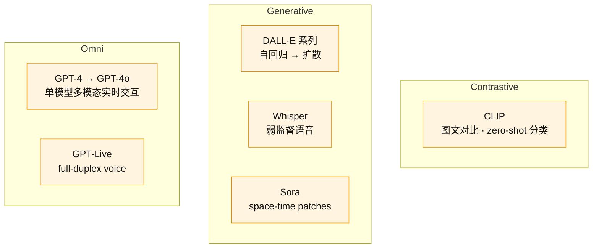

# Track S · Survey

目标 mastery 1～2：能识别时间、术语和范式差异，不做实验。

## 范式对比

## 概念卡

| # | 卡片 | 状态 | Mastery |
|---|---|---|---|
| S1 | [[multimodal-paradigms]] | 未写 | 0 |
| S2 | [[gpt-live-full-duplex]] | 未写 | 0 |

← [[index]]
