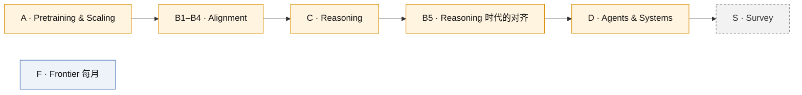

# OpenAI 创新知识库

四条因果主线，两条辅线。每条主线的 MOC 里有主线因果图和概念卡索引。

| 主线 | MOC | 主线问题 |
|---|---|---|
| A | [[A-pretraining-scaling]] | 如何在没有标注的情况下学到可迁移的通用能力？ |
| B | [[B-alignment]] | 只会续写的模型如何变成按意图行事的模型？ |
| C | [[C-reasoning]] | 如何用推理时的计算换正确率，并把它训练出来？ |
| D | [[D-agents-systems]] | 模型如何在环境中多步行动，系统如何保证可靠？ |
| S | [[S-survey]] | Multimodal 与 Voice 的范式识别（浅层） |
| F | [[F-frontier]] | 最新发布的证据分类（每月滚动） |

## 学习顺序

## 规范

写卡之前先读 [[README|知识库规范]]。
