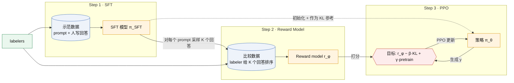
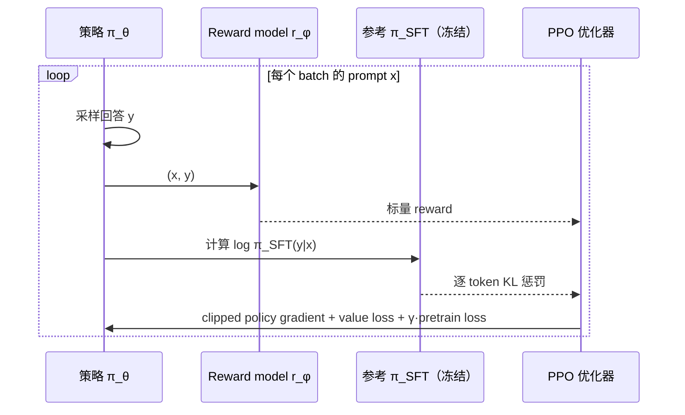

# InstructGPT 与 ChatGPT

> [!note] 这是格式示范
> 内容基于 InstructGPT 论文（Ouyang et al., 2022）的公开描述，用来展示图、公式、callout 和链接的写法。正式卡片在学完 B3 后由 session 产出，`status` 才能是 candidate 或 canonical。

用人类示范和偏好比较，把只会续写的 GPT-3 变成按指令行事的模型；三阶段流程 SFT → Reward Model → PPO 成为后续所有对话模型的公开范式。

> [!success] Public algorithm
> 三阶段流程、RM 的成对比较损失、带 KL 惩罚和预训练混合项的 PPO 目标，论文均有公式。

> [!info] Public system behavior
> ChatGPT 官方页面只说"与 InstructGPT 相同的方法，数据收集方式略有不同"，没有给出新公式。

> [!question] Inference
> ChatGPT 的对话数据规模和标注流程细节是推断，依据是 InstructGPT 论文的流程描述。

> [!danger] Unknown
> 生产模型的具体超参数、数据量、reward model 规模未公开。

## 1. 承接的瓶颈

[[gpt-3-in-context-learning|GPT-3]] 能 few-shot，但不听指令、会编造、会输出有害内容；原因是预训练目标"预测下一个 token"和用户目标"有帮助且诚实"不一致。[[rlhf-learning-to-summarize|Learning to Summarize]] 已证明 RM + PPO + KL 在单一任务上可行，问题是能否推广到开放指令。

## 2. 核心思想

三个阶段各自更新什么参数：

| 阶段 | 数据来源 | 更新的参数 | 冻结的部分 |
|---|---|---|---|
| SFT | 人写示范 | 整个 LM | 无 |
| RM | 人对采样回答的排序 | RM（从 SFT 初始化，输出标量） | 采样用的 SFT |
| PPO | 只有 prompt，回答由策略生成 | 策略 $\pi_\theta$（含 value head） | $r_\phi$、$\pi_{\mathrm{SFT}}$ |

## 3. 目标函数与数据

**Reward model**：对同一 prompt 的 $K$ 个回答两两配对，$y_w$ 是被偏好的那个：

$$
\mathcal{L}_{\mathrm{RM}}(\phi)
= -\frac{1}{\binom{K}{2}}\,
\mathbb{E}_{(x,\,y_w,\,y_l)\sim D}
\Big[\log \sigma\big(r_\phi(x,y_w) - r_\phi(x,y_l)\big)\Big]
$$

$\sigma$ 是 sigmoid，$\binom{K}{2}$ 归一化使每个 prompt 的权重相同，而不是回答多的 prompt 权重更大。

**PPO-ptx 目标**：

$$
\begin{aligned}
\mathcal{J}(\theta)
&= \mathbb{E}_{x\sim D_{\mathrm{RL}},\; y\sim\pi_\theta(\cdot\mid x)}
\Big[\, r_\phi(x,y) \;-\; \beta \log\frac{\pi_\theta(y\mid x)}{\pi_{\mathrm{SFT}}(y\mid x)} \Big] \\
&\quad + \gamma\, \mathbb{E}_{x\sim D_{\mathrm{pretrain}}}\big[\log \pi_\theta(x)\big]
\end{aligned}
$$

| 项 | 作用 | 对应流程 |
|---|---|---|
| $r_\phi(x,y)$ | RM 给整段回答打的标量分 | Step 3 每个 episode 结束时 |
| $\beta\,\mathrm{KL}$ 项 | 按 token 累加的惩罚，防止策略偏离 SFT 太远导致 RM 被 hack | 每个 token 的 reward 里减去 |
| $\gamma$ 项 | 混入预训练梯度，减轻 alignment tax | 与 PPO 梯度相加 |

**PPO 本身**（来自 [[ppo-human-preferences-2017|PPO 2017]]）：

$$
L^{\mathrm{CLIP}}(\theta)
= \mathbb{E}_t\Big[\min\big(\rho_t \hat A_t,\;
\operatorname{clip}(\rho_t,\,1-\epsilon,\,1+\epsilon)\,\hat A_t\big)\Big],
\qquad
\rho_t=\frac{\pi_\theta(a_t\mid s_t)}{\pi_{\theta_{\mathrm{old}}}(a_t\mid s_t)}
$$

这里 $s_t$ 是 prompt 加已生成前缀，$a_t$ 是下一个 token，$\hat A_t$ 由 value head 估计。

## 4. 训练循环

## 5. 推理行为

推理时只用 $\pi_\theta$，RM 和参考模型都不参与；行为变化全部体现在权重里，与 [[gpt-3-in-context-learning|ICL]] 靠上下文改变行为不同。

## 6. Scaling 维度

论文的关键证据是 1.3B 参数的 InstructGPT 在人类偏好上胜过 175B 的 GPT-3：对齐带来的收益不沿参数量轴，而沿"人类反馈数据"轴。

## 7. 证据

| 主张 | 证据 | 来源 |
|---|---|---|
| 1.3B InstructGPT 优于 175B GPT-3 | labeler 偏好率 | 论文 Fig. 1 |
| 存在 alignment tax | 公开 NLP benchmark 下降 | 论文 §4.2 |
| PPO-ptx 减轻 tax | 混合预训练梯度后回升 | 论文 §4.2 |

## 8. 局限

- 对齐到的是标注者群体的偏好，不是普遍偏好；
- RM 可被过优化（见 [[rlhf-learning-to-summarize]] 的 over-optimization 曲线）；
- 仍会编造事实，仍能被越狱。

## 9. 后续影响

直接影响 [[scalable-oversight]]（标注者不够强怎么办）和 [[process-vs-outcome-supervision]]（对整段打分粗，能否按步骤打分）。非 OpenAI 的 DPO 把 RM 和 PPO 合并成一个闭式损失，是最常见的对照。

## 10. 与相关方法的区别

| 维度 | InstructGPT（RLHF） | DPO（非 OpenAI，对照） | Deliberative Alignment |
|---|---|---|---|
| 显式 RM | 有 | 无 | 有（reward 来自 spec 判断） |
| 在线采样 | 有 | 无 | 有 |
| 改变的环节 | Step 2 + 3 | 合并 Step 2 + 3 | Step 3 的 reward 来源 |

## 最小示例或实验

E4：用小型 pretrained LM 做 RM + 一轮简化策略优化，画 reward 与 KL 的权衡曲线。

## 常见误解

- "ChatGPT 是新算法"：官方说明是 InstructGPT 方法的延续；
- "RLHF 让模型学到新知识"：RLHF 主要改变行为分布，知识来自预训练。

## 我曾经答错的地方

（示范卡留空）

## 掌握证据

（示范卡留空）

## 待验证内容

- ChatGPT 对话数据的收集方式与 InstructGPT 的具体差异。

← [[B-alignment]]
