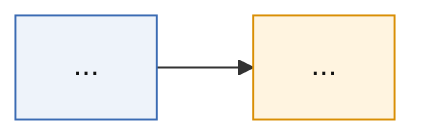

---
title:
aliases: []
track: A
level: 2
status: candidate
mastery: 0
importance: 0
created:
updated:
source_check:
sources: []
tags: [openai, track/A, status/candidate]
---

# 标题

一句话定义。

> [!success] Public algorithm
> 

> [!info] Public system behavior
> 

> [!question] Inference
> 

> [!danger] Unknown
> 

## 1. 承接的瓶颈

上一代是 [[...]]，它的问题是……

## 2. 核心思想

## 3. 目标函数与数据

$$
\mathcal{L}(\theta) = \ldots
$$

符号说明：

## 4. 训练循环

## 5. 推理行为

## 6. Scaling 维度

## 7. 证据

| 主张 | 证据 | 来源 |
|---|---|---|

## 8. 局限

## 9. 后续影响

直接影响 [[...]]。

## 10. 与相关方法的区别

| 维度 | 本方法 | 对照方法 |
|---|---|---|

## 最小示例或实验

## 常见误解

## 我曾经答错的地方

## 掌握证据

## 待验证内容

← [[<track-moc>]]
